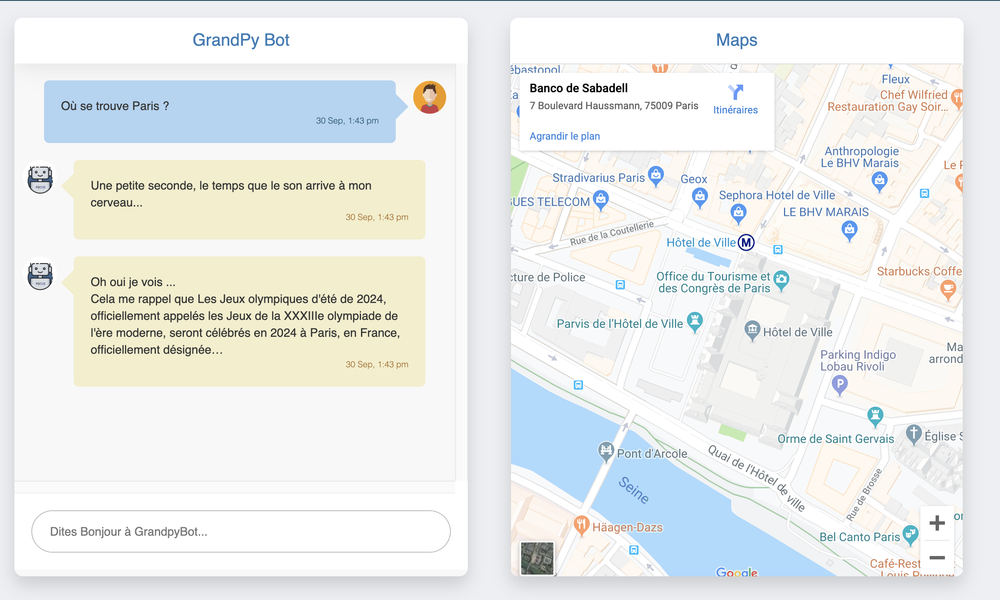

# GrandPy-Bot 
## Global Information
This project is a chatbot. You can ask him some questions concerning differents locations as : 
- "Où est Paris ?"
- "Où se situe la tour Eiffel ?"
- "Quelle est l'adresse de Rome ?"

GrandPyBot will find location and indicates you on map, then he will find an anecdote concerning location. 

For this project Geocode (gmaps API function), Geosearch (wikipedia API function) are used.

This project is also available on : https://grandpy-bot-vb.herokuapp.com/
## LocalHost
To run on localhost :
- Run the following command   `pip install -r flask/requirements.txt`
- Uncomment  lines 76 and 77 in flask/app.py in main
- Then run following command : `python3 /flask/app.py`. The localserver will run on port 80
